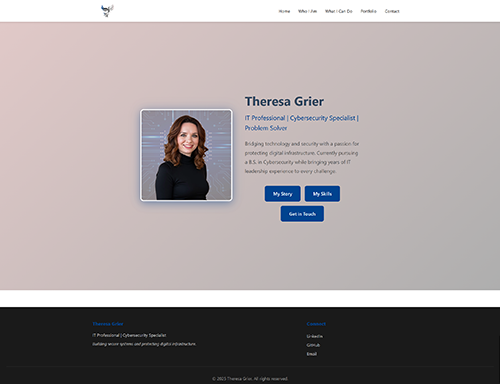

# Theresa Grier - Professional Portfolio


](https://app.netlify.com/projects/tgrier-website/deploys)

> Personal portfolio website showcasing IT security expertise, cybersecurity credentials, and professional experience



---

## 📋 Overview

This is my professional portfolio website, designed to showcase my journey as an IT Professional and Cybersecurity Specialist. The site features a "progressive revelation" design philosophy - visitors can explore different facets of my professional identity through dedicated pages, each revealing a different aspect of who I am while maintaining cohesive professional positioning.

Built with modern web technologies and deployed on Netlify, this portfolio serves as a central hub for potential employers, clients, and professional connections to learn about my technical skills, certifications, and career experience.

**Live Site:** [theresagrier.com](https://theresagrier.com)  
**Status:** Maintained

---

## ✨ Key Features

- **Progressive Revelation Design** - Five distinct pages showcasing different personality aspects while maintaining professional cohesion
- **Dynamic Certification Display** - Real-time Credly badge integration for current certifications
- **Responsive Design** - Optimized experience across desktop, tablet, and mobile devices
- **Professional Branding** - Custom color palette and cohesive visual identity
- **Contact Form Integration** - Netlify Forms with email notifications for direct communication
- **Fast Performance** - Static site generation with Astro for optimal load times

---

## 🚀 Quick Start

### Prerequisites

- Node.js v18 or higher
- npm or yarn package manager

### Installation
```bash
# Clone the repository
git clone https://github.com/TreeGee73/tg-website.git
cd tg-website

# Install dependencies
npm install

# Run development server
npm run dev
```

The site will be available at `http://localhost:4321`

### Build for Production
```bash
# Build static site
npm run build

# Preview production build locally
npm run preview
```

---

## 🛠️ Technology Stack

### Frontend
- **Astro** - Static site generator for optimal performance and modern developer experience
- **HTML/CSS** - Semantic markup and custom styling
- **JavaScript** - Interactive components and form handling

### Deployment
- **Netlify** - Hosting platform with continuous deployment from GitHub
- **Netlify Forms** - Contact form backend with email notifications
- **Netlify DNS** - Domain management and SSL/TLS certificates

### Design & Assets
- **Custom Brand Colors** - Professional color palette aligned with personal branding
- **Credly API** - Dynamic certification badge display
- **Responsive Images** - Optimized assets for web performance

---

## 📁 Project Structure
```
tg-website/
├── public/
│   ├── images/          # Static images and assets
│   └── form.html        # Static form for Netlify detection
├── src/
│   ├── layouts/         # Page layout templates
│   ├── pages/           # Site pages (index, about, contact, etc.)
│   └── styles/          # Global styles
├── astro.config.mjs     # Astro configuration
├── netlify.toml         # Netlify deployment configuration
└── package.json         # Project dependencies
```

---

## 🎨 Design Philosophy

The website employs a "progressive revelation" approach where each page unveils a different facet of my professional identity:

- **Home** - First impression and core value proposition
- **Who I Am** - Personal story, resilience, and career journey
- **What I Can Do** - Technical skills and certifications
- **Portfolio** - Project showcases and work examples
- **Contact** - Professional connections and communication

This structure allows visitors to engage as deeply as they choose while maintaining a cohesive narrative throughout.

---

## 📄 License

This project is licensed under the MIT License - see the [LICENSE](LICENSE) file for details.

---

## 👤 Author

**Theresa Grier**  
*IT Professional | Cybersecurity Specialist*

- 🌐 Website: [theresagrier.com](https://theresagrier.com)
- 💼 LinkedIn: [linkedin.com/in/theresa-grier](https://linkedin.com/in/theresa-grier)
- 🐙 GitHub: [@TreeGee73](https://github.com/TreeGee73)
- 📧 Email: theresa.grier@proton.me

---

## 🏢 GeeCubed, LLC

Co-Founder & Operations Lead  
Technical services company specializing in IT infrastructure and web development

---

## 📞 Support

For questions about this portfolio or professional inquiries:
- Use the contact form on the website
- Connect via LinkedIn
- Email directly at theresa.grier@proton.me

---